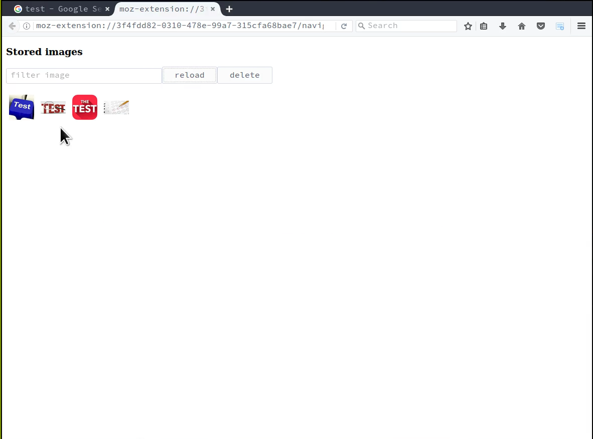

# "Image Reference Collector" example

## What it does

This example adds a context menu which target any image element in the webpage,
when the context menu action is clicked, the extension open a window and add
the related image element to the preview list of the collected images,
the user can then store the collected images by giving the collection a name
and pressing the **save** button.

Once a collection of reference images has been stored by the extension, they
can be navigated using the extension page that the extension will open in a tab
when the user press the extension **browserAction**.

## What it shows

The main goal of this example is showing how to use the [idb-file-storage library](https://www.npmjs.com/package/idb-file-storage) to store and manipulate files in a WebExtension.

* How to store blob into the extension IndexedDB storage
* How to list the stored blobs (optionally by filtering the listed blobs)
* How to turn the stored blobs into blob urls to show them in the extension page
* How to remove the stored blobs from the extension IndexedDB storage.

## Usage

This example is built using Babel and Webpack, and so the transpiled bundles have to
be built first:

you need to change into the example subdirectory and install all
[NodeJS][nodejs] dependencies with [npm](http://npmjs.com/) or
[yarn](https://yarnpkg.com/):

    npm install

Start the continuous build process to transpile the code into something that
can run in Firefox or Chrome:

    npm run build

This creates a WebExtension in the `extension` subdirectory.
()Any time you edit a file, it will be rebuilt automatically).

In another shell window, run the extension in Firefox using a wrapper
around [web-ext][web-ext]:

    npm start

## Icons

The icon for this extension is provided by [icons8](https://icons8.com/).
