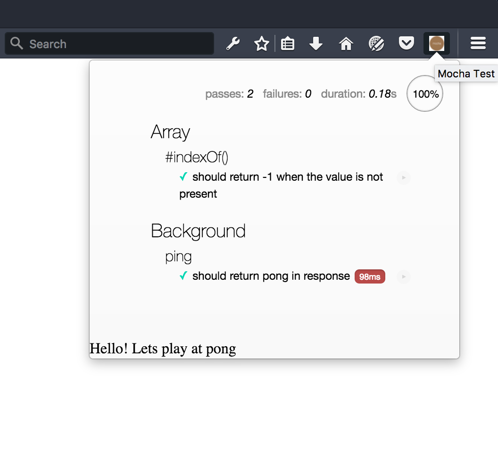

# Mocha client tests for WebExtensions
## Introduction
This example shows two methods of testing a WebExtension:
* Running tests from within the addon
* Running tests from the commandline using Karma

See https://github.com/Standard8/example-webextension for a more complete example of WebExtension test configuration.

## Install Dependencies:
```
  npm install
```
To run tests from within the addon:
```
  cd addon
  npm install
```

## Testing within the Addon
This gives you the possibility to run client tests inside the addon with the mocha UI.
If you don't want to use the mocha UI, you can install [WebConsole-reporter](https://github.com/eeroan/WebConsole-reporter).

### Run with web-ext cli
Just run `npm run web-ext` (will work with FF dev edition), if you have error with web-ext cli please add path for FF binary file with `--firefox-binary /path/to/firefox-bin`
[(web-ext docs)](https://developer.mozilla.org/en-US/Add-ons/WebExtensions/web-ext_command_reference).

When the addon starts, click on the mocha icon in your browser bar to run the tests:



This will test  `./addon/background.js` with `./addon/tests/lib/background-messaging.test.js`.

## Testing from the Commandline
This uses [Karma](http://karma-runner.github.io) to run tests from the commandline. Just type `npm test` to test `./addon/background.js` with `./tests/lib/background.test.js`.

### Debug  Mode
Use `npm run test:debug` to run Karma in watch mode. Whenever you modify a Javascript file, the tests will automatically rerun.

You can install [karma-notification-reporter](https://www.npmjs.com/package/karma-notification-reporter) to display test results in a desktop notification. You'll need to add `--reporters=dots,notification` to the `test:debug` command line of
`package.json` to enable it.
