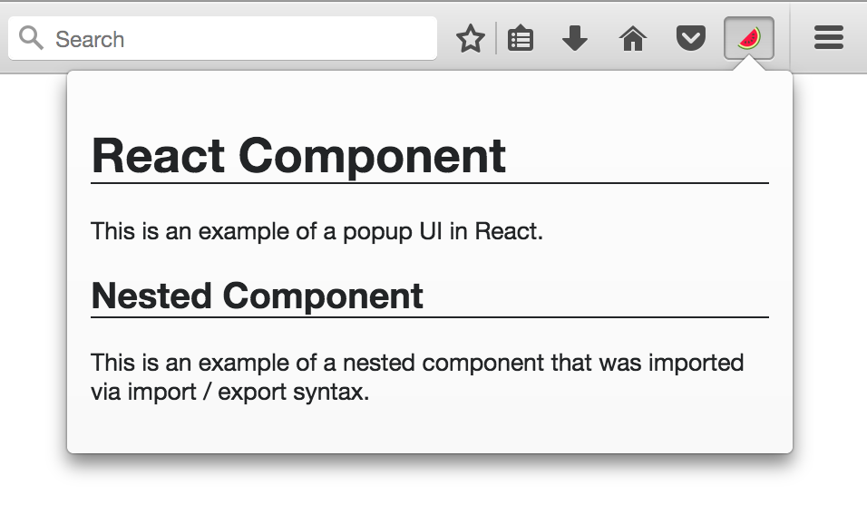

# React / ES6 Popup Example

## What it does

This is an example of creating a browser action
[popup](https://developer.mozilla.org/en-US/Add-ons/WebExtensions/Add_a_button_to_the_toolbar#Adding_a_popup)
UI in [React][react] and [ES6](http://es6-features.org/) JavaScript.

## What it shows

* How to bundle [React][react] and any other [NodeJS][nodejs] module into an
  extension.
* How to transpile code that is not supported natively in
  a browser such as
  [import / export](https://developer.mozilla.org/en-US/docs/Web/JavaScript/Reference/Statements/import)
  syntax and [JSX](https://facebook.github.io/react/docs/jsx-in-depth.html).
* How to continuously build code as you edit files.
* How to customize [web-ext][web-ext] for your extension's specific needs.
* How to structure your code in reusable ES6 modules.

## Usage

First, you need to change into the example subdirectory and install all
[NodeJS][nodejs] dependencies with [npm](http://npmjs.com/) or
[yarn](https://yarnpkg.com/):

    npm install

Start the continuous build process to transpile the code into something that
can run in Firefox or Chrome:

    npm run build

This creates a WebExtension in the `extension` subdirectory.
Any time you edit a file, it will be rebuilt automatically.

In another shell window, run the extension in Firefox using a wrapper
around [web-ext][web-ext]:

    npm start

Any time you edit a file, [web-ext][web-ext] will reload the extension
in Firefox. To see the popup, click the watermelon icon from the browser bar.
Here is what it looks like:

[react]: https://facebook.github.io/react/
[nodejs]: https://nodejs.org/en/
[web-ext]: https://developer.mozilla.org/en-US/Add-ons/WebExtensions/Getting_started_with_web-ext

## Icons

The icon for this extension is provided by [icons8](https://icons8.com/).
