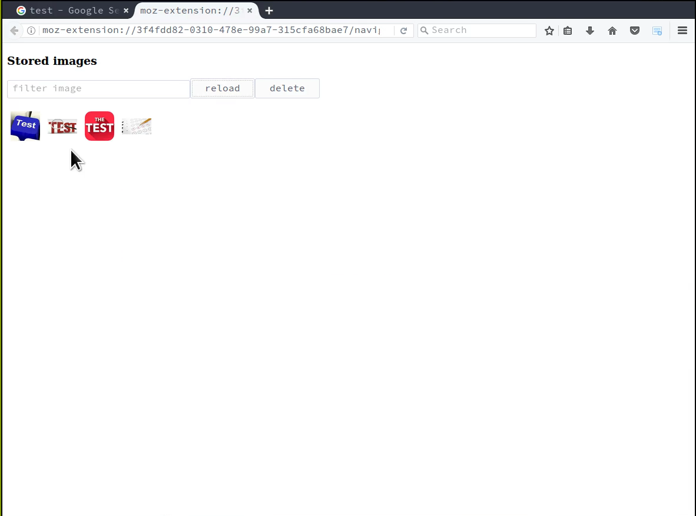

# "Image Reference Collector" example

## What it does

This example adds a context menu which targets any image element in the webpage.
When the context menu item is clicked, the add-on opens a window and
adds the related image element to the preview list of the collected images.
The user can then store the collected images by giving the collection a name
and pressing the **save** button.

Once a collection of reference images has been stored by the add-on, they
can be navigated using the extension page that the add-on will open in a tab
when the user press the add-on **browserAction**.

## What it shows

The main goal of this example is showing how to use the [idb-file-storage library](https://www.npmjs.com/package/idb-file-storage) to store and manipulate files in a WebExtension.

* How to store blob into the add-on IndexedDB storage
* How to list the stored blobs (optionally by filtering the listed blobs)
* How to turn the stored blobs into blob urls to show them in the extension page
* How to remove the stored blobs from the extension IndexedDB storage.

This example is written in two forms:

- a plain webextension (which doesn't need any build step)
- a webextension built using webpack

The code that stores and retrieves the files from the IndexedDB storage is in the
file named `utils/image-store.js` in both the example version.

## Icons

The icon for this add-on is provided by [icons8](https://icons8.com/).
