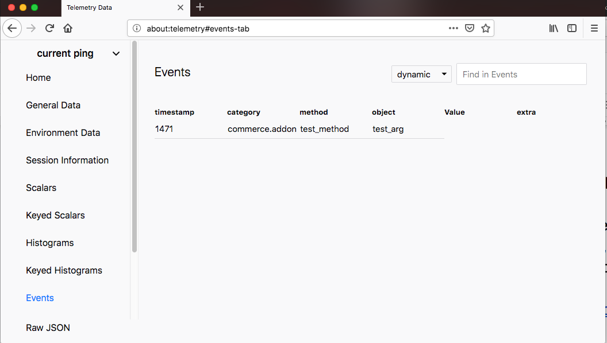
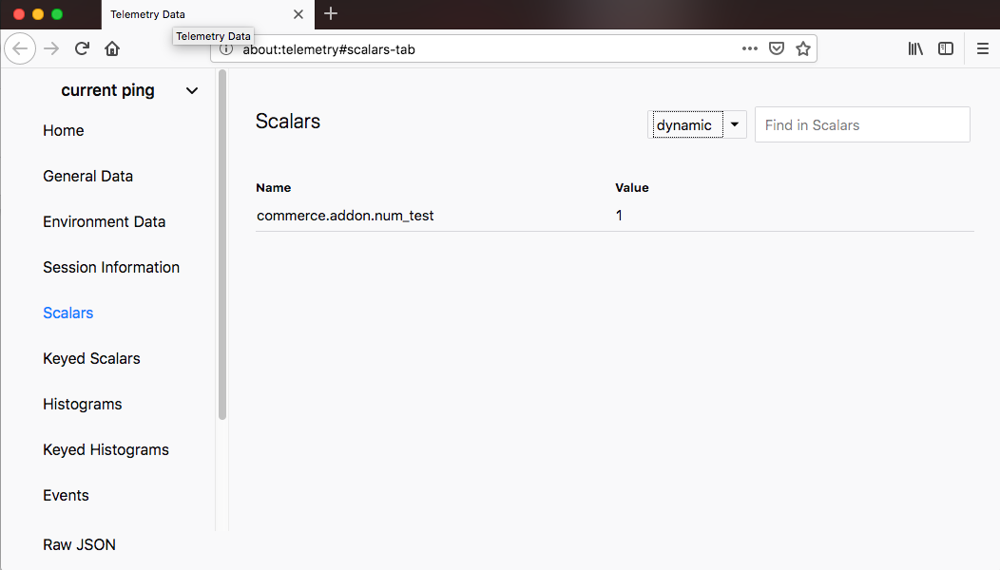

# Telemetry Test WE

## What it does

This extension includes:

* A background script, "telemetry.js", that registers and records some events and scalars.

## What it shows

* How to use the Telemetry WE API by registering and recording an event and scalar ping.

**Events**

**Scalars**
